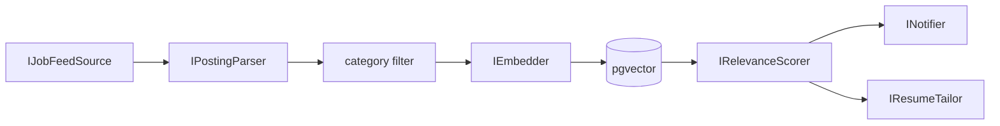

# JobLens

An automated job-search pipeline: it ingests postings from WhatsApp job-feed groups,
scores each one against a candidate profile using an LLM, and can auto-tailor a CV
(via Rezi) to the strongest matches. Built as a portfolio project to demonstrate
LLM agent/pipeline design, a real (if small) RAG component, and MCP client
integration - not a production SaaS. It's a single-user tool, run locally against
one person's WhatsApp account and Rezi account.

## Architecture

Every stage is one interface with one implementation, wired together via
dependency injection - swapping any stage (a different message source, a different
LLM provider, a different notification channel) means adding an implementation and
changing a DI registration, not touching the rest of the pipeline.



- **IJobFeedSource** reads new messages from a WhatsApp bridge's local SQLite
  store, filtered to specific group chat IDs. Source-agnostic by design - a
  Telegram implementation would sit behind the same interface.
- **IPostingParser** turns a raw message into a structured job posting
  (title/company/location/category/description), mostly deterministic parsing of
  a fixed feed format, with an LLM fallback for anything that doesn't match.
- **category filter** drops off-target postings before anything expensive runs.
- **IEmbedder** + pgvector embed and store surviving postings for semantic search
  and as the scorer's cheap first pass.
- **IRelevanceScorer** ranks by cosine similarity to the candidate profile, then
  sends only the top-K shortlist to the LLM for a considered score + reasoning.
- **INotifier** sends matches above a threshold; **IResumeTailor** rewrites a
  resume for a specific match on request.

Scoring, tailoring, and embedding all go through `Microsoft.Extensions.AI`
abstractions, not a provider SDK directly - but chat and embeddings are two
separate providers with two separate jobs:

```text
JobLens
│
├── Embeddings
│   └── Gemini API
│       └── gemini-embedding-001
│           └── 1536 dimensions
│
├── Relevance scoring
│   └── OmniRoute
│       └── Llm:ScoringModel
│           └── normally coding-fallback
│
└── Resume tailoring
    └── OmniRoute
        └── Llm:TailoringModel
            └── separately pinned model
```

**Gemini is embeddings-only.** It never sees a chat/scoring/tailoring prompt.
**OmniRoute handles all chat/reasoning** - both relevance scoring and resume
tailoring - through two provider-neutral roles, `IScoringChatClient` and
`ITailoringChatClient`, each wrapping its own `IChatClient` built from an
independently configurable model ID (`Llm:ScoringModel` / `Llm:TailoringModel`).
No unqualified `IChatClient` is registered in DI, so a future consumer can't
accidentally pick up the wrong role's client. Tailoring must never use
`coding-fallback` as its model - `Program.ValidateRequiredConfig` refuses to
start if `Llm:TailoringModel` is configured equal to a `coding-fallback`
`Llm:ScoringModel`, since a resume rewrite has a much higher cost-of-error than
a discarded relevance score.

`Llm:TailoringModel` (currently `cc/claude-sonnet-5` in local dev config) is a
**provisional default, not a permanently pinned choice.** The representative
comparison between `cc/claude-sonnet-5` and `no-think/cc/claude-sonnet-5` -
which should decide the final pin based on JSON cleanliness, schema compliance,
output quality, constraint-following, and predictable parsing - hasn't been run
yet (it needs OmniRoute quota that wasn't available while this was written) and
isn't required for this refactor to be correct.

OmniRoute is an **external prerequisite process**, not something JobLens
starts, stops, or manages. JobLens doesn't manage provider OAuth sessions,
refresh Claude/Codex tokens, or implement provider-specific quota/fallback
logic - all of that lives in OmniRoute. The *intended* fallback chain is
`Claude -> Codex -> configured free fallback providers`, but only part of that
is actually verified end to end: direct OmniRoute Chat Completions requests
work, JSON-mode direct requests have worked, and direct Codex aliases have
worked through Chat Completions despite their catalog metadata indicating the
Responses API. The actual `coding-fallback` Claude-to-Codex transition has not
been forced or observed, and the configured free-provider tail is unverified.
Docs in this repo say "intended" and "observed" on purpose, not "verified end
to end," where that distinction actually matters.

## Key technical decisions

**RAG with a cosine prefilter before the LLM.** Every posting and the candidate
profile get embedded into pgvector. Ranking candidates by cosine similarity first
and sending only the top-K to the model keeps LLM calls to a bounded, meaningful
shortlist instead of one call per posting - cheaper, faster, and it's the part of
the project that's genuinely RAG (the semantic `/query` endpoint reuses the same
embedding archive) rather than just an LLM pipeline wearing a RAG label.

**Provider-agnostic scoring.** Built entirely against `Microsoft.Extensions.AI`
abstractions so the LLM provider is a DI detail, not baked into the scoring logic.

**MCP client for resume tailoring.** Rezi (the CV tool used here) has no public
REST API - only an MCP server. Reaching it meant building a real MCP client with
the official C# `ModelContextProtocol` SDK, including working through OAuth 2.1
registration quirks specific to Rezi's server and a hybrid text+JSON tool-response
format that isn't documented anywhere - not just calling a REST endpoint with a
different label. A latent bug here (a test that verified the write's side effect
by reading the resume back, but never actually parsed the write call's own
response) sat invisible for two phases - a reminder that a test is only as strong
as what it asserts, not what it happens to exercise.

**DPAPI-encrypted token cache.** Rezi's OAuth access tokens last ~30 days with no
refresh token, so a long-running service needs to persist and reuse a token across
restarts without popping a browser mid-request. The token is cached encrypted at
rest (Windows DPAPI) rather than as plaintext; when it's missing or expired the
service fails fast with a clear instruction to re-run a small login helper, rather
than hanging or silently retrying.

**Honesty and item-ID integrity enforced in code, not just prompted.** The resume
rewrite is instructed never to fabricate skills or experience - but that
instruction alone is only ever a suggestion to the model. What's actually
enforced in code: the rewrite is constrained to the exact set of existing resume
item IDs from the chosen base resume; any ID the model invents is detected and
dropped before it's ever written, and every original item is guaranteed to survive
the rewrite (either with new text or, if the model left it alone, its original
text) regardless of what the model returns. The structural guarantee doesn't
depend on the model behaving.

## The eval story

Milestone 7 added an eval harness that runs a hand-labeled set of real archived
postings through the *actual* production path - the same embed → cosine prefilter
→ LLM-score pipeline the live `/run` endpoint uses, not a separate test harness -
and computes precision/recall/F1 against human-judged relevance.

The first real run: **1.0 precision, 0.18 recall.** Reading the per-item
reasoning showed two concrete problems, not a vague "needs tuning":

1. The scoring prompt was hard-penalizing junior-appropriate postings just for
   listing 1-3 years of experience, even when the stack and domain were a strong
   fit - it was treating a soft signal as a hard filter.
2. The match threshold sat above where real matches actually clustered, so
   several genuinely-relevant postings scored well but still missed the cutoff.

Fixes: softened the prompt's experience-requirement penalty (stated years become
a soft signal - reserve low scores for genuine mismatches like wrong domain,
wrong discipline, or senior/lead roles) and lowered the threshold. Separately,
the initial "labeled" set turned out to be auto-seeded from category membership
(anything in the target categories marked relevant), which grades the scorer
against the exact filter it's supposed to improve on - so several postings that
were categorized right but obviously wrong on read (an "Aeronautics/EE navigation
algorithms" posting under Software, biomedical/mechanical-engineering roles under
QA/ML) needed hand-correcting before the eval numbers meant anything.

Result: **recall 0.18 → 0.63, F1 0.31 → 0.77, precision held at 1.0.** LLM scoring
isn't perfectly deterministic, so an individual eval run can land a few points
either side of that (observed range during testing: recall 0.38-0.63) - but the
roughly 3.5x recall improvement from these two changes is the real, repeatable
signal, not noise from a single lucky run.

## Tech stack

.NET 10 · ASP.NET Core (minimal API) · PostgreSQL + pgvector · Npgsql ·
Microsoft.Extensions.AI · Google Gemini (embeddings only, via its
OpenAI-compatible endpoint) · OmniRoute (all chat/reasoning - relevance
scoring and resume tailoring - an external prerequisite process JobLens never
starts, stops, or authenticates) · Model Context Protocol (C# SDK) for the
Rezi integration · xUnit

## Running it

Full setup (WhatsApp bridge, Postgres, secrets) is in [SETUP.md](SETUP.md). Once
running:

| Endpoint | What it does |
|---|---|
| `POST /ingest` | Pulls new WhatsApp messages, parses, category-filters, embeds, and stores them in pgvector. |
| `POST /run` | Scores every unscored posting in the archive against the profile and notifies matches. |
| `GET /matches` | Stored matches (score at or above threshold) from past runs. |
| `GET /query?text=...` | Semantic search over the embedded posting archive. |
| `POST /tailor?messageId=X&commit=false` | Previews (default) or, with `commit=true`, writes an AI-tailored resume rewrite back to Rezi for one stored posting. |
| `POST /eval` | Runs the hand-labeled set through the real scoring pipeline and reports precision/recall/F1. |

### `/tailor` safety contract

`commit` omitted, or `commit=false`, always produces a fully validated preview
and zero Rezi writes. `commit=true` runs, in order: (1) validate the
configured write destination (`Rezi:ForEditResumeId`, trimmed, non-blank, not
equal to any base resume id) *before* any tailoring model call; (2) call the
tailoring model and get back a `ValidatedTailoredResume`; (3) re-run
`ValidateComplete` as a defense-in-depth gate; (4) build the write payload from
that validated result only; (5) re-run `ValidateComplete` again immediately
before writing; (6) make exactly one `WriteResumeAsync` call. The write
destination is configuration-controlled and never model-controlled - the model
picks *which base resume* to draw from, never *where the rewrite gets written*.
JobLens does not automatically retry a failed write: if the transport fails
after the request reached Rezi, a retry could duplicate or unexpectedly
overwrite data, so an ambiguous write failure surfaces as an error instead of
being silently retried.

| Status | Meaning |
|---|---|
| 404 | No stored posting for that `messageId`. |
| 401 | Rezi authentication required (token missing/expired - see [SETUP.md](SETUP.md) step 7). |
| 502 | Rezi upstream tool call failed, or the tailoring model returned unusable structured output. |
| 503 | Tailoring model/provider unavailable at the transport level. |
| 422 | Deterministic resume-tailoring validation failed (invented id, blank field, etc.) - well-formed response, unprocessable content. |
| 500 | Unsafe or missing local write configuration (`Rezi:ForEditResumeId`) - a JobLens config bug, not an upstream failure. |

None of these responses echo internal model output or the configured Rezi
resume id back to the caller.

Relevance scoring is intentionally lower-risk and fail-soft, unlike tailoring:
an invalid structured response gets one retry, and if it's still invalid that
batch just returns no scores rather than failing the request. Resume tailoring
is fail-closed instead - any failure anywhere in the chain above produces zero
writes, never a partial or best-effort one.

175 tests pass (xUnit, non-live/default filter). Three integration test files -
`EvalEndpointIntegrationTests`, `LlmRelevanceScorerIntegrationTests`, and
`PgvectorDatastoreIntegrationTests` - need a live Postgres/Gemini/OmniRoute
connection and are excluded from that default filter
(`--filter "Category!=Integration"`). The whole loop - ingest, score, notify,
tailor, and write back to Rezi - has been run end to end against real data, not
just mocked.

## Roadmap / designed but not built

- **Feed the full CV into scoring**, not just a short profile summary, for a
  tighter match signal.
- **Telegram as a second source** - `IJobFeedSource` is already source-agnostic;
  this is a new implementation, not a redesign.
- **Loop-until-empty `/run`** - currently scores one top-K batch per call rather
  than draining the whole unscored backlog in one request.
- **Further Rezi tailoring guardrails and enhancements** - e.g. resume-format-aware
  writes and cover-letter tailoring on top of the current summary/experience/skills
  rewrite.
