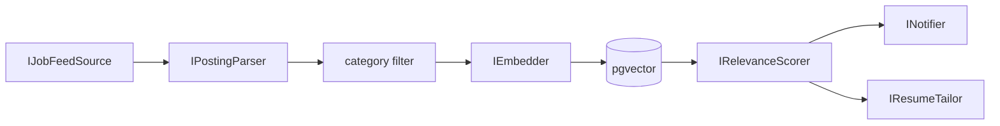

# JobLens

An automated job-search pipeline: it ingests postings from WhatsApp job-feed groups,
scores each one against a candidate profile using an LLM, and can auto-tailor a CV
(via Rezi) to the strongest matches. Built as a portfolio project to demonstrate
LLM agent/pipeline design, a real (if small) RAG component, and MCP client
integration - not a production SaaS. It's a single-user tool, run locally against
one person's WhatsApp account and Rezi account.

## Architecture

Every stage is one interface with one implementation, wired together via
dependency injection - swapping any stage (a different message source, a different
LLM provider, a different notification channel) means adding an implementation and
changing a DI registration, not touching the rest of the pipeline.



- **IJobFeedSource** reads new messages from a WhatsApp bridge's local SQLite
  store, filtered to specific group chat IDs. Source-agnostic by design - a
  Telegram implementation would sit behind the same interface.
- **IPostingParser** turns a raw message into a structured job posting
  (title/company/location/category/description) with a deterministic parser for
  the fixed job-bot formats, including known short header variants; messages that
  do not match those structures are skipped.
- **category filter** drops off-target postings before anything expensive runs.
- **IEmbedder** + pgvector embed and store surviving postings for semantic search
  and as the scorer's cheap first pass.
- **IRelevanceScorer** ranks by cosine similarity to the candidate profile, then
  sends only the top-K shortlist to the LLM for a considered score + reasoning.
- **INotifier** sends matches above a threshold; **IResumeTailor** rewrites a
  resume for a specific match on request.

Scoring, tailoring, and embedding all go through `Microsoft.Extensions.AI`
abstractions, not a provider SDK directly - but chat and embeddings are two
separate providers with two separate jobs:

```text
JobLens
│
├── Embeddings
│   └── Gemini API
│       └── gemini-embedding-001
│           └── 1536 dimensions
│
├── Relevance scoring
│   └── OmniRoute
│       └── Llm:ScoringModel
│           └── normally coding-fallback
│
└── Resume tailoring
    └── OmniRoute
        └── Llm:TailoringModel
            └── separately pinned model
```

**Gemini is embeddings-only.** It never sees a chat/scoring/tailoring prompt.
**OmniRoute handles all chat/reasoning** - both relevance scoring and resume
tailoring - through two provider-neutral roles, `IScoringChatClient` and
`ITailoringChatClient`, each wrapping its own `IChatClient` built from an
independently configurable model ID (`Llm:ScoringModel` / `Llm:TailoringModel`).
No unqualified `IChatClient` is registered in DI, so a future consumer can't
accidentally pick up the wrong role's client. Tailoring must never use
`coding-fallback` as its model - `Program.ValidateRequiredConfig` refuses to
start if `Llm:TailoringModel` is configured equal to a `coding-fallback`
`Llm:ScoringModel`, since a resume rewrite has a much higher cost-of-error than
a discarded relevance score.

`Llm:TailoringModel` (currently `cc/claude-sonnet-5` in local dev config) is a
**provisional default, not a permanently pinned choice.** The representative
comparison between `cc/claude-sonnet-5` and `no-think/cc/claude-sonnet-5` -
which should decide the final pin based on JSON cleanliness, schema compliance,
output quality, constraint-following, and predictable parsing - hasn't been run
yet (it needs OmniRoute quota that wasn't available while this was written) and
isn't required for this refactor to be correct.

OmniRoute is an **external prerequisite process**, not something JobLens
starts, stops, or manages. JobLens doesn't manage provider OAuth sessions,
refresh Claude/Codex tokens, or implement provider-specific quota/fallback
logic - all of that lives in OmniRoute. The *intended* fallback chain is
`Claude -> Codex -> configured free fallback providers`, but only part of that
is actually verified end to end: direct OmniRoute Chat Completions requests
work, JSON-mode direct requests have worked, and direct Codex aliases have
worked through Chat Completions despite their catalog metadata indicating the
Responses API. The actual `coding-fallback` Claude-to-Codex transition has not
been forced or observed, and the configured free-provider tail is unverified.
Docs in this repo say "intended" and "observed" on purpose, not "verified end
to end," where that distinction actually matters.

## Key technical decisions

**RAG with a cosine prefilter before the LLM.** Every posting and the candidate
profile get embedded into pgvector. Ranking candidates by cosine similarity first
and sending only the top-K to the model keeps LLM calls to a bounded, meaningful
shortlist instead of one call per posting - cheaper, faster, and it's the part of
the project that's genuinely RAG (the semantic `/query` endpoint reuses the same
embedding archive) rather than just an LLM pipeline wearing a RAG label.

**Provider-agnostic scoring.** Built entirely against `Microsoft.Extensions.AI`
abstractions so the LLM provider is a DI detail, not baked into the scoring logic.

**MCP client for resume tailoring.** Rezi (the CV tool used here) has no public
REST API - only an MCP server. Reaching it meant building a real MCP client with
the official C# `ModelContextProtocol` SDK, including working through OAuth 2.1
registration quirks specific to Rezi's server and a hybrid text+JSON tool-response
format that isn't documented anywhere - not just calling a REST endpoint with a
different label. A latent bug here (a test that verified the write's side effect
by reading the resume back, but never actually parsed the write call's own
response) sat invisible for two phases - a reminder that a test is only as strong
as what it asserts, not what it happens to exercise.

**DPAPI-encrypted token cache.** Rezi's OAuth access tokens last ~30 days with no
refresh token, so a long-running service needs to persist and reuse a token across
restarts without popping a browser mid-request. The token is cached encrypted at
rest (Windows DPAPI) rather than as plaintext; when it's missing or expired the
service fails fast with a clear instruction to re-run a small login helper, rather
than hanging or silently retrying.

**Honesty and item-ID integrity enforced in code, not just prompted.** The resume
rewrite is instructed never to fabricate skills or experience - but that
instruction alone is only ever a suggestion to the model. What's actually
enforced in code: the rewrite is constrained to the exact set of existing resume
item IDs from the chosen base resume; any ID the model invents is detected and
dropped before it's ever written, and every original item is guaranteed to survive
the rewrite (either with new text or, if the model left it alone, its original
text) regardless of what the model returns. The structural guarantee doesn't
depend on the model behaving.

## The eval story

Milestone 7 added an eval harness that runs a hand-labeled set of real archived
postings through the *actual* production path - the same embed → cosine prefilter
→ LLM-score pipeline the live `/run` endpoint uses, not a separate test harness -
and computes precision/recall/F1 against human-judged relevance.

The first real run: **1.0 precision, 0.18 recall.** Reading the per-item
reasoning showed two concrete problems, not a vague "needs tuning":

1. The scoring prompt was hard-penalizing junior-appropriate postings just for
   listing 1-3 years of experience, even when the stack and domain were a strong
   fit - it was treating a soft signal as a hard filter.
2. The match threshold sat above where real matches actually clustered, so
   several genuinely-relevant postings scored well but still missed the cutoff.

Fixes: softened the prompt's experience-requirement penalty (stated years become
a soft signal - reserve low scores for genuine mismatches like wrong domain,
wrong discipline, or senior/lead roles) and lowered the threshold. Separately,
the initial "labeled" set turned out to be auto-seeded from category membership
(anything in the target categories marked relevant), which grades the scorer
against the exact filter it's supposed to improve on - so several postings that
were categorized right but obviously wrong on read (an "Aeronautics/EE navigation
algorithms" posting under Software, biomedical/mechanical-engineering roles under
QA/ML) needed hand-correcting before the eval numbers meant anything.

Result: **recall 0.18 → 0.63, F1 0.31 → 0.77, precision held at 1.0.** LLM scoring
isn't perfectly deterministic, so an individual eval run can land a few points
either side of that (observed range during testing: recall 0.38-0.63) - but the
roughly 3.5x recall improvement from these two changes is the real, repeatable
signal, not noise from a single lucky run.

On **2026-08-16**, the same 20-item eval was re-run after chat/reasoning moved to
OmniRoute (Gemini remained embeddings-only): **precision 1.0, recall 0.50, F1
0.67** (4 true positives, 0 false positives, 4 false negatives, 12 true
negatives). That is within the previously observed recall range and confirms the
current OmniRoute-routed scoring path, not OmniRoute's upstream fallback chain.

## Tech stack

.NET 10 · ASP.NET Core (minimal API) · PostgreSQL + pgvector · Npgsql ·
Microsoft.Extensions.AI · Google Gemini (embeddings only, via its
OpenAI-compatible endpoint) · OmniRoute (all chat/reasoning - relevance
scoring and resume tailoring - an external prerequisite process JobLens never
starts, stops, or authenticates) · Model Context Protocol (C# SDK) for the
Rezi integration · xUnit

## Running it

Full setup (WhatsApp bridge, Postgres, secrets) is in [SETUP.md](SETUP.md). Once
running:

| Endpoint | What it does |
|---|---|
| `POST /ingest` | Pulls new WhatsApp messages, parses, category-filters, embeds, and stores them in pgvector - and nothing else. It never scores, notifies, or drafts: postings are stored unscored so the next `/run` scores them exactly once. Returns ingest counters only (`fetched`, `parsed`, `filteredOut`, `alreadyStored`, `newlyStored`). |
| `POST /run` | Scores every unscored posting in the archive against the profile, notifies matches, and automatically creates a persisted `TailoredDraft` (zero Rezi writes) for postings scoring at or above `AutoTailorThreshold`. |
| `GET /matches` | Stored matches (including `messageId`, score, and reasoning) from past runs; pass that id to `/tailor`. |
| `GET /query?text=...` | Semantic search over the embedded posting archive. |
| `POST /tailor?messageId=X` | Creates (or returns the existing) persisted `TailoredDraft` for one scored posting, using the posting's already-persisted scoring template. Zero Rezi writes. |
| `GET /tailored` | Lists all persisted tailored drafts, newest first. |
| `GET /tailored/{draftId}` | Retrieves one persisted tailored draft by id. |
| `POST /tailored/{draftId}/export-to-rezi` | Writes that exact persisted draft's content to Rezi's `ForEditResumeId` slot and marks it exported. The only endpoint that writes to Rezi. |
| `POST /eval` | Runs the hand-labeled set through the real scoring pipeline and reports precision/recall/F1. |

### Shared pipeline-run lock (`POST /ingest`, `POST /run`)

`POST /ingest` and `POST /run` both mutate the same pgvector rows (embeddings,
`scored_at`, drafts), so they share one exclusive, cross-process file lock
(`%LOCALAPPDATA%\JobLens\run.lock`) guarding at most one pipeline-mutating
request at a time. Acquisition is immediate and non-blocking - a request that
loses the race never falls back to waiting or retrying. If either endpoint is
called while the other (or the same one) already holds the lock, it returns
immediately, before any feed/parse/embed/score work, with:

```json
409 Conflict
{"error":"Another JobLens pipeline run is already in progress."}
```

An unlocked call behaves exactly as documented above; the lock is released as
soon as that request finishes (success, error, or client disconnect), and the
now-empty `run.lock` file is left in place rather than deleted - a persistent,
zero-byte lock file on disk is the normal steady state between runs, not
something to clean up.

### One-shot scheduled run (`--run-once`)

```
dotnet run --project src/JobLens.Api -- --run-once
```

This is the unattended equivalent of "check the environment, then `POST /ingest`,
then `POST /run`" - but it is one in-process operation, not three HTTP calls. It
never starts a second JobLens process and never calls its own endpoints. The
flow is:

```
acquire the shared run lock -> preflight -> ingest -> score the backlog
  -> report -> exit
```

The lock above is the same `run.lock` `POST /ingest` and `POST /run` share, and
one handle is held continuously across all three stages, so a scheduled run and
a manual endpoint call can never interleave. Acquisition is immediate: if
another run already holds the lock, this one does no preflight, no ingest, and
no scoring, logs the conflict, and exits `2`. The command returns before the web
host starts, so no Kestrel listener is left running afterwards.

| Exit code | Meaning |
|---|---|
| `0` | Completed successfully. |
| `1` | Fatal - preflight found a broken environment, or the run failed unexpectedly. Nothing downstream of the failure ran. |
| `2` | Another pipeline run already holds the shared lock. Nothing ran. |
| `3` | Completed, but degraded - see below. Ingest and scoring results are still valid and still persisted. |
| `4` | Cancelled (Ctrl+C or host shutdown). Whatever finished before the cancellation is still reported. |

Degraded (`3`) means the run finished and its work stands, but something needs
attention:

- **The WhatsApp bridge is down.** The bridge is only the writer into the local
  SQLite store; if that store is still readable, ingest and scoring proceed
  normally against it. You just are not getting *new* messages until the bridge
  is back.
- **Rezi authentication failed.** Scoring, matching, and notification results
  are preserved in full; only automatic drafting was skipped. This is the case
  that is invisible in `POST /run`'s JSON response - `--run-once` is where it
  becomes a visible run outcome.
- **A scoring call failed at the transport level** (OmniRoute unreachable or
  timed out). The fail-soft scoring path still returns whatever it managed, and
  the failure is reported per template rather than being swallowed into a
  successful-looking empty run.
- **The pipeline stopped early, or a recoverable per-posting drafting failure
  occurred.** Neither is fatal; both are reported.

A *stale* source (no recent message in the configured groups) is a warning only
- it is reported but does not by itself make the run degraded, since a quiet
group is normal. Likewise, ingesting zero new postings does not skip scoring:
the backlog of already-stored-but-unscored postings is still scored.

Standalone `--preflight` is unchanged by this: it stays read-only and never
touches the lock, so it can be run safely while a pipeline run is in progress.

PostgreSQL, the read-only WhatsApp bridge, OmniRoute, and Rezi authentication
remain external prerequisites - `--run-once` checks them and reports on them,
but never starts, stops, or authenticates any of them. `--run-once` itself does
not install, register, or schedule anything - publishing the app and registering
it with Windows Task Scheduler is deployment tooling that lives outside the
application, in `scripts/` and SETUP.md's "Scheduled operation" section.

### Tailoring and export safety contract

PostgreSQL is the source of truth for tailored drafts; Rezi is only a mutable
editing workspace. `POST /tailor` never writes to Rezi and never lets the
tailoring model choose a base resume - it uses the `selected_template` that
scoring (`POST /run`) already persisted on the posting, maps that template
name to exactly one configured `Rezi:BaseResumes` entry via a fail-closed
1:1 name match (no live listing/reading of all Rezi resumes to choose among
them), reads only that one base resume, tailors it, re-validates the result
with `ResumeTailoringValidator.ValidateComplete`, and persists a new
`TailoredDraft` row (or returns the existing one for that
`(messageId, selectedTemplate, baseResumeId)` triple unchanged, without a
second model call). A posting that was never scored, or was scored before
multi-template support (`selected_template` is `NULL`), fails closed with a
"rescore required" error rather than silently guessing. Draft content
(summary, experience, skills, rationale) is immutable after creation - only
`status`/`exportedAt` can change, and only via export.

`POST /tailored/{draftId}/export-to-rezi` is the sole write path to Rezi. It
loads the persisted draft, validates the write destination
(`Rezi:ForEditResumeId`, trimmed, non-blank, not equal to any configured base
resume id) *before* any write, re-validates the stored content defensively,
builds the write payload from that exact stored content only, and makes
exactly one `WriteResumeAsync` call. The draft is marked `ExportedToRezi`
(with `exportedAt`) only *after* that write succeeds, so a failed write never
falsely marks a draft exported. Exporting the same draft again, or exporting
other drafts in between, is safe - each export re-reads the immutable stored
snapshot for that specific draft id. JobLens does not automatically retry a
failed write: if the transport fails after the request reached Rezi, a retry
could duplicate or unexpectedly overwrite data, so an ambiguous write failure
surfaces as an error instead of being silently retried.

**`POST /tailor` status codes**

| Status | Meaning |
|---|---|
| 404 | No stored posting for that `messageId`. |
| 409 | Posting exists but has no persisted scoring template/score - rescore it first (`POST /run`). |
| 500 | The persisted scoring template no longer maps to any configured `Rezi:BaseResumes` entry - a JobLens config-drift bug. |
| 401 | Rezi authentication required (token missing/expired - see [SETUP.md](SETUP.md) step 7). |
| 502 | Rezi upstream tool call failed, or the tailoring model returned unusable structured output. |
| 503 | Tailoring model/provider unavailable at the transport level. |
| 422 | Deterministic resume-tailoring validation failed (invented id, blank field, etc.) - well-formed response, unprocessable content. |

**`POST /tailored/{draftId}/export-to-rezi` status codes**

| Status | Meaning |
|---|---|
| 404 | No persisted draft for that `draftId`. |
| 401 | Rezi authentication required (token missing/expired - see [SETUP.md](SETUP.md) step 7). |
| 502 | Rezi upstream tool call failed. |
| 422 | Stored draft content failed defensive re-validation before write. |
| 500 | Unsafe or missing local write configuration (`Rezi:ForEditResumeId`) - a JobLens config bug, not an upstream failure. |

None of these responses echo internal model output or the configured Rezi
resume id back to the caller.

### Automatic drafting for strong matches (`POST /run`)

`JobLens:AutoTailorThreshold` (default `80`, must be within `[0, 100]` and `>=
JobLens:MatchThreshold` - checked at startup by `Program.ValidateRequiredConfig`)
adds a third score tier on top of `MatchThreshold`'s existing two:

| Score | Behavior |
|---|---|
| `< MatchThreshold` | Score persisted. No match notification. No draft. |
| `>= MatchThreshold`, `< AutoTailorThreshold` | Score/match persisted, normal notification - unchanged from before. No draft. |
| `>= AutoTailorThreshold` | Score/match persisted and notified, **and** a `TailoredDraft` is automatically created or reused via the exact same `TailoredDraftService.CreateOrGetAsync` path `POST /tailor` uses - same idempotency, same trusted-template guardrails, same zero-Rezi-writes contract. |

This only ever runs against postings scored in the current `/run` call; it never
retroactively drafts historical rows just because the threshold changes.
Automatic tailoring is fail-soft at the run level: a tailoring/model/Rezi-read/
validation failure for one strong match is logged and counted, but does not
discard that posting's already-persisted score/match and does not stop scoring
or drafting other postings in the same run (cancellation still propagates
immediately). `POST /run`'s response includes `draftsCreated`, `draftsReused`,
and `tailoringFailures` alongside the existing `batches`/`scored`/`matched`/
`notified`/`stoppedEarly`/`stopReason` fields.

Relevance scoring is intentionally lower-risk and fail-soft, unlike tailoring:
an invalid structured response gets one retry, and if it's still invalid that
batch just returns no scores rather than failing the request. Resume tailoring
and export are fail-closed instead - any failure anywhere in either chain
above produces zero writes and no status change, never a partial or
best-effort one.

The whole non-live test suite passes (xUnit, default filter). Four integration
test files - `EvalEndpointIntegrationTests`,
`LlmRelevanceScorerIntegrationTests`, `PgvectorDatastoreIntegrationTests`, and
`PgvectorTailoredDraftStoreIntegrationTests` - need a live Postgres (the last
two) or Postgres/Gemini/OmniRoute (the first two) connection and are excluded
from that default filter (`--filter "Category!=Integration"`). The ingest,
score, and notify loop has been run end to end against real data; persisted
tailored-draft creation and export are covered by hermetic and Postgres
integration tests but a live Rezi write has not been re-verified against this
milestone's new explicit-export endpoint.

## Roadmap / designed but not built

- **Feed the full CV into scoring**, not just a short profile summary, for a
  tighter match signal.
- **Telegram as a second source** - `IJobFeedSource` is already source-agnostic;
  this is a new implementation, not a redesign.
- **Further Rezi tailoring guardrails and enhancements** - e.g. resume-format-aware
  writes and cover-letter tailoring on top of the current summary/experience/skills
  rewrite.
